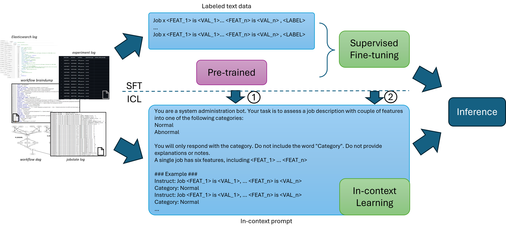

# Large Language Models for Anomaly Detection in Computational Workflows: from Supervised Fine-Tuning to In-Context Learning

<!-- <p align="center">
  
</p> -->


## Setup environment

* requirements:
  * python>=3.8
  * cuda>=11.8
  * conda
* run `setup.sh` script will automatically create a new conda environment named `hf` for the project.

## Data processing

* Extract the raw data from `raw_data.tar` to `raw_data` folder.

* Run scripts `data_processing.py` and create folders under `data` folder.
Each folder contains the data for one dataset, and four csv files: `all.csv`, `train.csv`, `validation.csv`, `test.csv` for all data, training data, validation data and test data respectively.

The folder structure and the md5sum of the files are as follows:

```bash
├── 1000genome
│   ├── all.csv         2cda70f14707683102426ae945623ab2
│   ├── test.csv        e4f808adaa5aa110bf1db26dea66658e
│   ├── train.csv       12c6554dab3594071afd5af6b159479e
│   └── validation.csv  fbff302e70a365447683a7ee557d9c47
├── montage
│   ├── all.csv         b83b1ec871d4c50acd384f821f06d43a
│   ├── test.csv        5a1da93d60cc703c0d12c673cdb0adc9
│   ├── train.csv       0374689cae2a7dcc6139043f702fc2f9
│   └── validation.csv  5b2acfe8b9e459e521c02b0c578a3030
└── predict_future_sales
    ├── all.csv         7638fc62503946a0e4db22a40eded33c
    ├── test.csv        6c04b27a497b1e7f56e4a23d6ae556c0
    ├── train.csv       c27a9039bc27cdaecafa1e41d64ffb41
    └── validation.csv  d0bedeaebbe8b7f765fe30aa0fef8654
```

* dataset is also available on huggingface hub: [HF link](https://huggingface.co/datasets/cshjin/poseidon)
  * accessing the dataset remotely via `datasets.load_dataset('cshjin/poseidon')`
  * accessing the dataset locallly via `raw_dataset = load_dataset("csv", data_files="path/to/csv")`

## Demos

* `demo` folder contains the scripts of the demostration in the paper, including
  * `sft.py`: supervised fine-tuning
  * `transfer_learning.py`: transfer learning with SFT
  * `sft_lora.py`: Efficient-parameter fine-tuning for SFT on large models
  * `online_detection.py`: online detection with SFT
  * `catastrophic_forgetting.py`: dealing with catastrophic forgetting via freezing
  * `icl.py`: in-context learning
